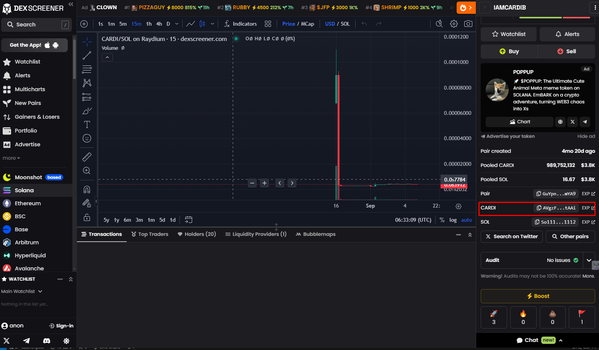
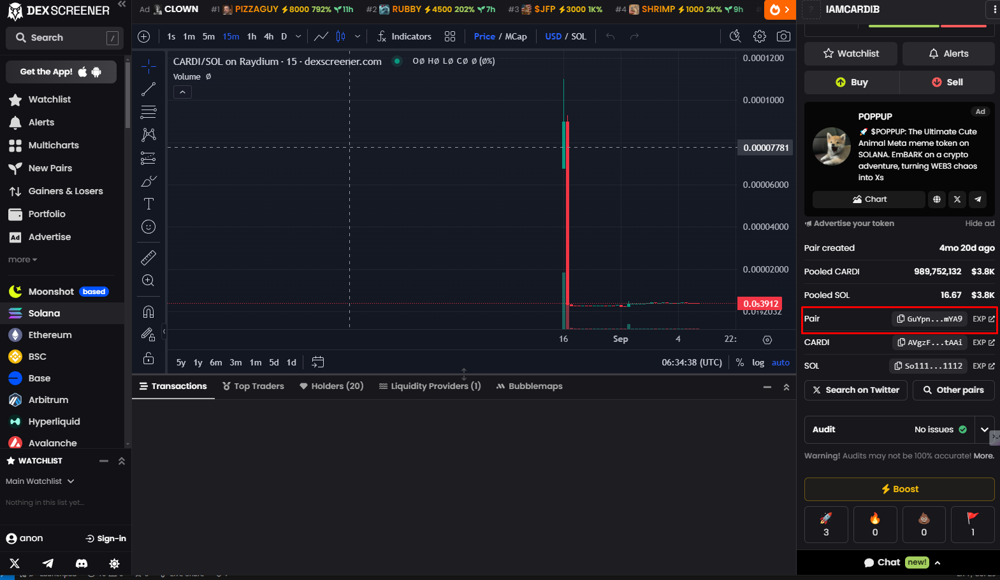
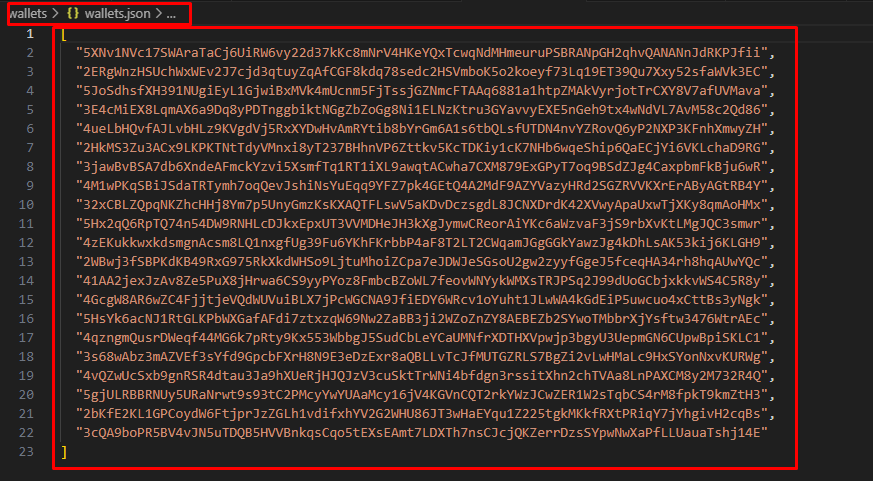
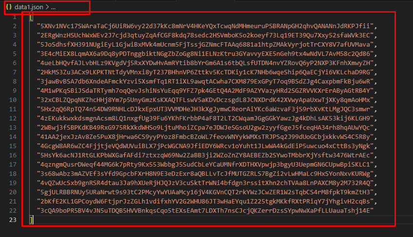

#  Raydium bundler bot V4 (extra)
This is the extra bot of Raydium bundler to avoid detecting from bubble maps

## Explain

   when you run Raydium bundler bot, You have some tokens in 21 wallets. But because Main wallet of Raydium bundler bot pay for 21 wallets to buy tokens , these wallets are detected as one person buy tokens in bubble map and link to main wallet. you can see that 21 wallets link each other with same color in bubble map.
   so we need these wallets show is owned with 21 people.
    This extra bot generate other 21 wallets and they buy tokens from old 21 wallets.
    At that time, new wallets claim sol from main wallet of extra bot and buy tokens with this sol.
    so bubble map detect that other 21 people buy tokens from old 21 wallets.so these wallets unlinked each other
    And old wallets have wsol about their tokens.
    And This bot have a feature to gather wsol from old 21 wallets.

## Contact me

discord:  @erikerik116

telegram: @erikerik116

## parameta

#### Clone my repository
Git clone https://github.com/erikerik116/Raydium-Bundler-Extra-Bot-V4-Avoid-Bubblemaps

#### Edit the `.env` File

1.BASE_MINT=   # Token mint address

 
2.POOL_ID=    # Raydium pool id 

3.MAIN_KP=    # main wallet address.
        The main wallet should have enough sol to buy tokens from old 21 wallet and 0.2 sol as fee more
        

4.RPC_URL=    # RPC WebSocket endpoint for Solana

## Guide
1.Run the Raydium Bundler bot.
    If you run the Raydium Bundler bot, the wallets.json file is made in wallets folder of Raydium volume bot folder.
    
    
2.Copy wallets
    Copy wallets from wallet.json to data1.json in Raydium Bundler Extra folder.
    
    
3.Run the Raydium Bundler extra bot.
    "npm run start" in terminal.

